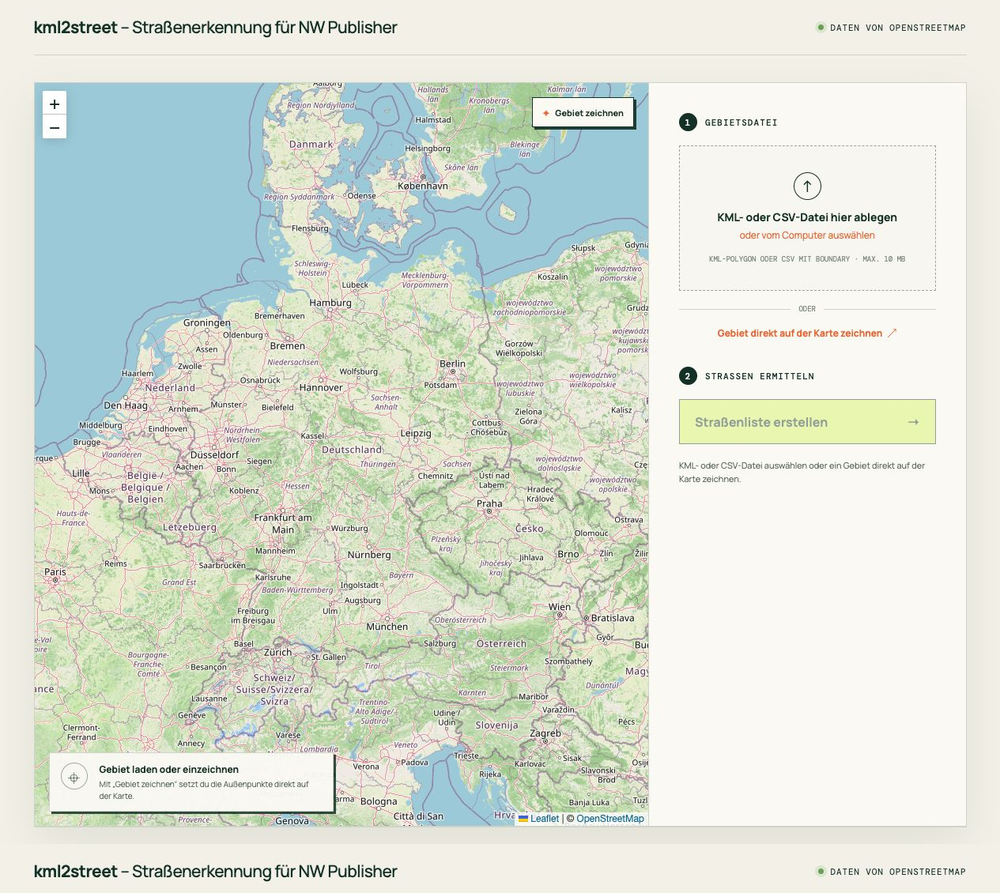

# kml2street

**Gebietsgrenzen rein, Straßenliste raus.** kml2street ist eine kleine Browser-App, die KML- und CSV-Gebiete mithilfe von OpenStreetMap in verständliche Straßen- und Hausnummernlisten umwandelt. Das Ergebnis lässt sich als CSV für NW Scheduler exportieren.



## Was die App kann

- KML-Dateien mit Polygonen einlesen
- CSV-Dateien mit einer `Boundary`-Spalte importieren
- Gebiete direkt auf der Karte einzeichnen und wieder als KML speichern
- Straßen und Adressen live über die OpenStreetMap Overpass API ermitteln
- Hausnummern kompakt und nach Straßenseite zusammenfassen
- Ergebnisse als CSV oder im 25-spaltigen NW-Scheduler-Format exportieren
- Gebietsmetadaten wie `TerritoryID`, `Number`, `CategoryCode` und `Category` beim CSV-Workflow erhalten

## Lokal starten

Voraussetzung: eine aktuelle Node.js-Version mit npm.

```bash
npm install
npm run dev
```

Anschließend die von Vite angezeigte lokale URL öffnen. Eine KML- oder CSV-Datei auswählen oder über **Gebiet zeichnen** mindestens drei Außenpunkte auf der Karte setzen. Danach **Straßenliste erstellen** anklicken.

## Unterstütztes CSV-Format

Die `Boundary`-Spalte enthält Koordinatenpaare in der Reihenfolge Längengrad, Breitengrad:

```csv
TerritoryID,Category,Number,Boundary
9003002,Velpke,3002,"[10.93964,52.41423],[10.94104,52.41604],[10.94309,52.41687],[10.93964,52.41423]"
```

`TerritoryID`, `Number`, `CategoryCode` und `Category` werden aus einem eindeutigen CSV-Gebiet übernommen und beim NW-Scheduler-Export wieder eingetragen. Bei KML-Dateien und direkt gezeichneten Gebieten bleiben diese Felder leer.

## NW-Scheduler-Export

Der Button **NW Scheduler CSV** erzeugt eine kommaseparierte UTF-8-Datei mit denselben 25 Spalten wie ein NW-Scheduler-Adress-Export. Jeder angezeigte Hausnummernbereich wird als eigener Datensatz ausgegeben. Hat eine Straße mehrere Bereiche, wird sie entsprechend oft mit jeweils genau einem Bereich in `Number` exportiert. Straßen ohne gefundene Hausnummern bleiben einmal mit leerem `Number` enthalten. Ort, Postleitzahl und Bundesland werden soweit verfügbar aus OpenStreetMap ergänzt.

`TerritoryAddressID` und `TerritoryAddressApartmentID` bleiben bewusst leer, damit beim Import keine bestehenden Adressen anhand fremder IDs aktualisiert werden.

## Hausnummern-Zusammenfassung

- Lückenlose Folgen werden möglichst kurz dargestellt: `1–20`.
- Getrennte Straßenseiten bleiben erkennbar: `1–15 (ungerade), 2–16 (gerade)`.
- Lücken erzeugen getrennte Einträge: `1–9 (ungerade), 15–21 (ungerade)`.
- Buchstabenzusätze und nicht standardisierte Werte bleiben erhalten.

## Entwicklung

```bash
npm test
npm run build
npm run preview
```

Technik: TypeScript, Vite, Vitest und Leaflet. Die Verarbeitung läuft im Browser; Straßen- und Adressabfragen gehen direkt an die Overpass API.

## Datenqualität

Die OpenStreetMap-Abdeckung unterscheidet sich je nach Ort. Benannte OSM-Straßen innerhalb des Polygons werden auch ohne erfasste Hausnummern aufgeführt. Hausnummernbereiche können nur gebildet werden, wenn `addr:street` und `addr:housenumber` gepflegt sind. Ergebnisse sollten deshalb vor der operativen Verwendung geprüft werden.

## Projektstatus

Dieses Projekt ist **vibe-coded** – mit KI-Unterstützung schnell aus einer konkreten Idee entstanden. Die Kernlogik ist mit automatisierten Tests abgedeckt, trotzdem ist das Projekt experimentell und Feedback ist willkommen.
